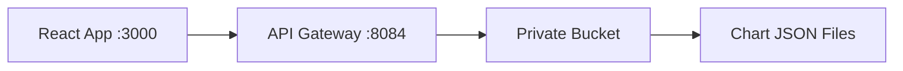

# Frontend Development Guide

## Overview

The frontend consists of:
- **React Web App** (`/web`) - Chart visualization interface
- **API Gateway** (`/functions/api_gateway.py`) - Secure data serving layer

Both services are configured in `docker-compose.yml` but **do not start automatically** to keep development focused on the core pipeline.

## Starting Frontend Services

### Local Development (Mock Data)
```bash
# Start API gateway + React app (local data)
docker compose --profile frontend up -d

# View logs
docker compose logs -f api-gateway web
```

### Live Development (Real Data)
```bash
# Start live API gateway + React app (connects to live bucket)
docker compose -f docker-compose.yml -f docker-compose.live.yml --profile frontend up -d

# View logs
docker compose -f docker-compose.yml -f docker-compose.live.yml logs -f api-gateway-live web-live
```

### Individual Services
```bash
# Local development - just API gateway
docker compose up api-gateway -d

# Live development - just API gateway
docker compose -f docker-compose.yml -f docker-compose.live.yml up api-gateway-live -d

# React app (depends on API gateway)
docker compose up web -d  # or web-live with live compose
```

### Mixed Development Scenarios
```bash
# Scenario 1: Live API gateway in Docker, React locally
docker compose -f docker-compose.yml -f docker-compose.live.yml up api-gateway-live -d
cd web && REACT_APP_API_URL=http://localhost:8084 npm start

# Scenario 2: Use deployed Cloud Function, React locally
cd web && REACT_APP_API_URL=https://us-central1-progressor-341702.cloudfunctions.net/api-gateway npm start
```

## Service URLs

### Local Development
- **React App**: http://localhost:3000
- **API Gateway**: http://localhost:8084
  - Health: http://localhost:8084/health
  - Distances: http://localhost:8084/activities/2025/distances
  - Pacings: http://localhost:8084/activities/2025/pacings
  - Summary: http://localhost:8084/activities/2025/summary

### Live Development
- **React App**: http://localhost:3000 (same port, different data)
- **API Gateway (Docker)**: http://localhost:8084 (connects to live bucket)
- **API Gateway (Cloud Function)**: https://us-central1-progressor-341702.cloudfunctions.net/api-gateway
  - Health: https://us-central1-progressor-341702.cloudfunctions.net/api-gateway/health
  - Distances: https://us-central1-progressor-341702.cloudfunctions.net/api-gateway/activities/2025/distances

## Environment Configuration

### API Gateway (Local)
- Reads from local/mock bucket data
- Environment: `GCP_BUCKET_NAME` from `.env`

### API Gateway (Live)
- Reads from private `desirelines_local_testing` bucket (live data)
- Uses mounted `~/.config/gcloud` credentials for authentication
- Environment: `GCP_BUCKET_NAME_LIVE` and `GCP_PROJECT_ID_LIVE` from `.env`

### React App (Local)
- API URL: `REACT_APP_API_URL=http://localhost:8084`
- Falls back to localhost:8084 if not set

### React App (Live)
- API URL: `REACT_APP_API_URL=http://localhost:8084` (live API gateway)
- Alternative: Direct Cloud Function URL when deployed
- Environment: `REACT_APP_ENV=live`
- Hot reload enabled via `CHOKIDAR_USEPOLLING=true`

## Security Model

### Current State (Development)
- API Gateway accesses private bucket via service account
- React app calls API gateway (not bucket directly)
- Both services run locally for development

### Production Deployment
- API Gateway deployed as Cloud Function
- React app build served via Cloud Storage/CDN
- Environment-specific API URLs

## Data Flow



## Development Workflow

1. **Start core pipeline** (normal development):
   ```bash
   make start  # or docker compose up -d
   ```

2. **Start frontend** (when working on UI):
   ```bash
   docker compose --profile frontend up -d
   ```

3. **Stop frontend** (back to core development):
   ```bash
   docker compose --profile frontend down
   ```

## Cost Impact

- **Local Development**: $0 (Docker only)
- **Cloud Function API**: ~$0.001/month (500 requests)
- **Total Impact**: Virtually $0 to existing $0.14/month budget

## Next Steps

- [ ] Deploy API Gateway as Cloud Function
- [ ] Remove public bucket access (security fix)
- [ ] Update production React app to use Cloud Function URL
- [ ] Add authentication/rate limiting (optional)
