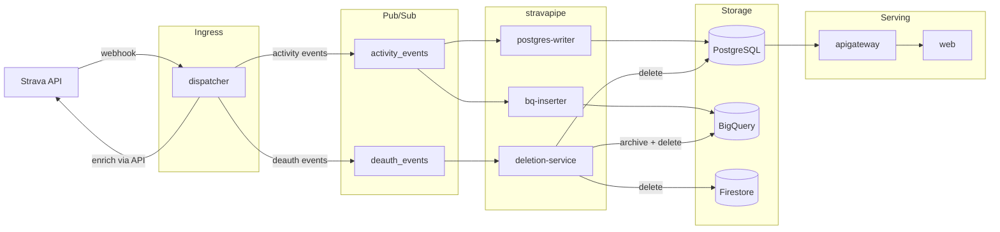

# Packages

## Overview

| Package | Language | Runtime | Description |
|---------|----------|---------|-------------|
| [**web**](web/) | TypeScript | Vite + React | Frontend — goal visualization, Strava OAuth, multi-sport dashboards |
| [**apigateway**](apigateway/) | Go | Cloud Run | REST API — serves activity data from PostgreSQL to the frontend |
| [**dispatcher**](dispatcher/) | Go | Cloud Run | Webhook receiver — enriches Strava events via API, publishes to Pub/Sub |
| [**stravapipe**](stravapipe/) | Python | Cloud Run (×3) + Job | Event processors — bq-inserter, postgres-writer, deletion-service, backfill |
| [**shared**](shared/) | Go | Library | Shared utilities — structured logging, OTel, rate limiting, Firestore token store |

## Data Flow

## Package Details

### web

React + TanStack Query frontend. Supports demo mode (no backend) and authenticated mode with Firebase. Lazy-loaded pages, abort signal propagation, and generated data fallbacks.

### apigateway

Go REST API with hexagonal architecture. Reads from PostgreSQL, serves filtered activity data. Handles Firebase auth validation, sport-type filtering, and cursor-based pagination. See [`openapi.yaml`](apigateway/openapi.yaml) for the API contract.

### dispatcher

Go webhook receiver — the only service that calls the Strava API. Enriches activity CREATE events with full activity data before publishing to Pub/Sub. Handles deauthorization webhooks by deleting Firestore tokens and publishing to a dedicated `deauth_events` topic. Uses protobuf for cross-language type sharing.

### stravapipe

Python mono-image with multiple Cloud Run entrypoints:

- **bq-inserter** — syncs activities to BigQuery (create, update, delete with archive)
- **postgres-writer** — syncs activities to PostgreSQL via SQLAlchemy
- **deletion-service** — deletes all user data on Strava deauthorization ([API Agreement §5.4](https://www.strava.com/legal/api))
- **backfill** — batch job for historical activity import

Hexagonal architecture: `domain/` → `ports/` → `adapters/` → `application/` → `cloudrun/`.

### shared

Go library imported by apigateway and dispatcher:

- `gcplog` — structured JSON logging for Cloud Run + GCP Error Reporting
- `otel` — OpenTelemetry tracing/metrics setup
- `ratelimit` — token bucket rate limiter
- `stravatoken` — Firestore token store types and paths
- `secrets` — secret loading utilities
